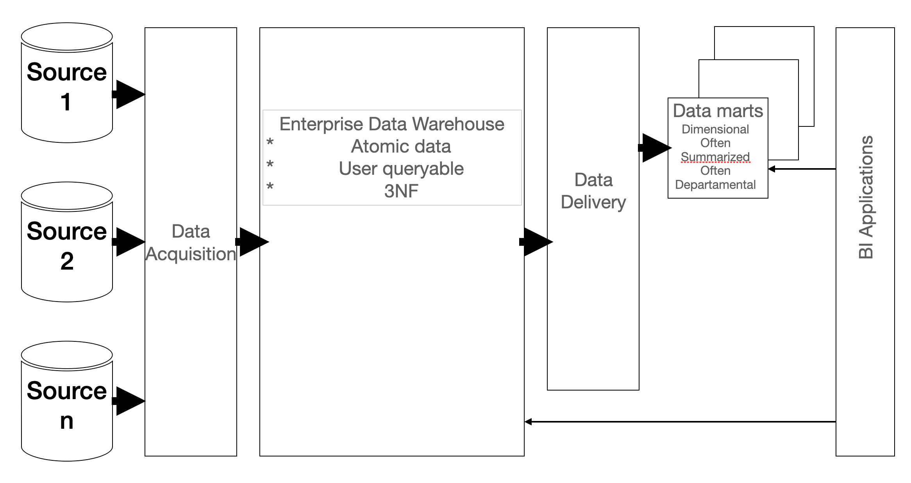
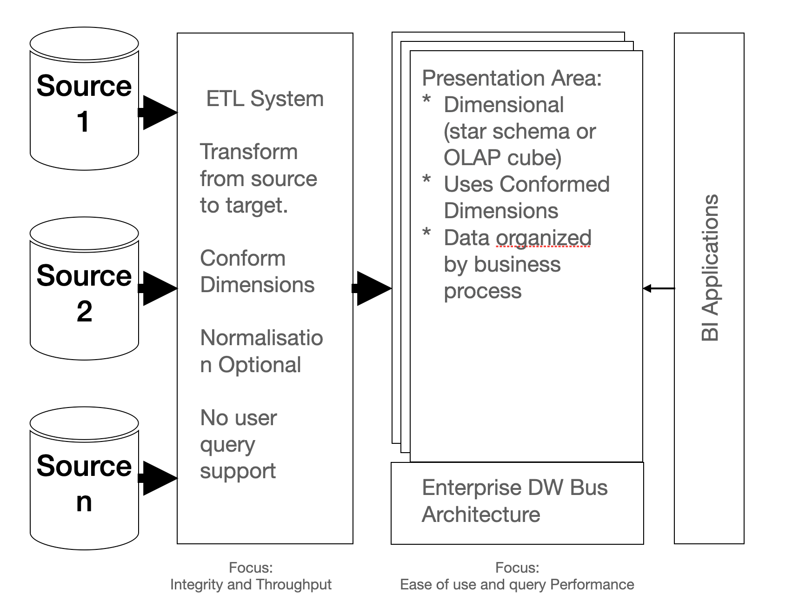
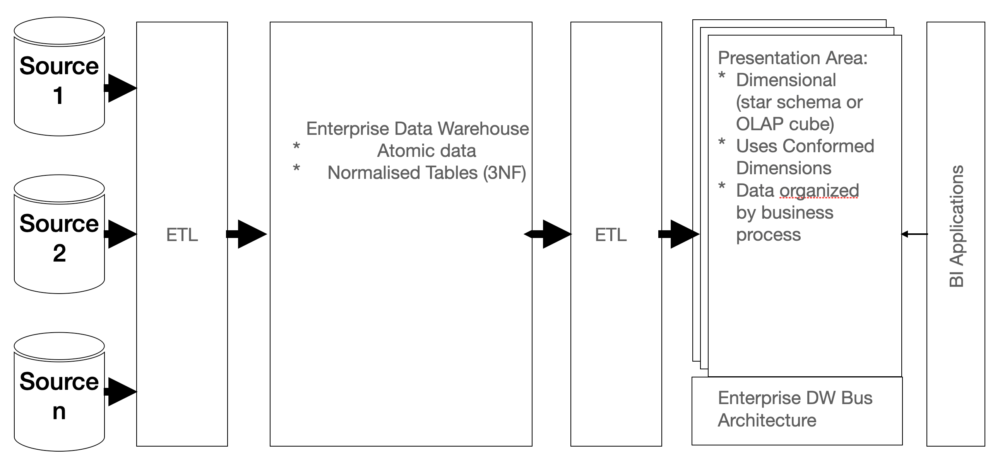

# S1E4 - Modeling OLAP

Data warehouses are built to support the efficient querying and analysis of data and typically store historical data from various sources, such as transactional systems, operational systems, and external data sources. The concept of data warehousing was first introduced in the late 1980s, as companies began to realize the value of analyzing large amounts of data from different sources to make better business decisions. Since then, the field of data warehousing has continued to evolve, with new technologies and techniques being developed to improve the performance and scalability of data warehouses. Today, data warehouses are a critical component of many organizations' BI infrastructure and support many business functions, including finance, marketing, and operations.

In other words:

Multiple Sources (systems of records, OLTP) --->Data--->   Datwarehouse (Typically OLAP)

We know from S1E3 the techniques you can use for modeling OLTP (using relational databases), but what about OLAP or Data warehouses? 

## DataMarts
A simplified illustration of the independent data mart "Architecture." These standalone analytic silos represent a Datawarehouse that is essentially un-architected. Although nobody pushes to implement this approach, it happens everywhere. Self-service BI tools without proper governance are a catalysator for this approach. 

## Inmon (Hub-and-Spoke Corporate Information Factory)
Here data is extracted from the system of records and lands in a 3NF(Third normal form, see previous seasons) database known as the EDW (Enterprise Data Warehouse). Datamarts can be dimensionally structured but differ from Kimball architecture because they are department centric rather than business process oriented. Users will query the EDW to get the most detailed data; however, subsequent ETL also populate data marts.

## Kimball (Datawarehouse architecture)
Data in the presentation area must be dimensional, atomic (can have aggregates to improve performance), business process-centric, and adhere to the enterprise data warehouse bus architecture. You must NOT structure the data to individual departments' interpretation of the data.

## Hybrid (Kimball + Inmon)
There are people that claim is the best of both worlds. 

## Datavault

I invite you to check this [link](https://datavaultalliance.com/news/building-a-real-time-data-vault-in-snowflake/) where you can find the architecture of Datavault. This diagram has a technology vendor bias, but could not find any other from the Data Vault Alliance.

